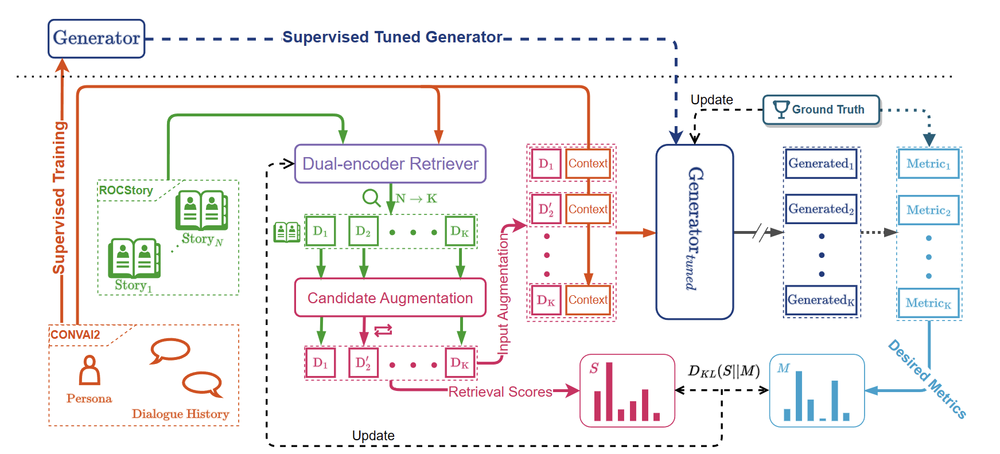
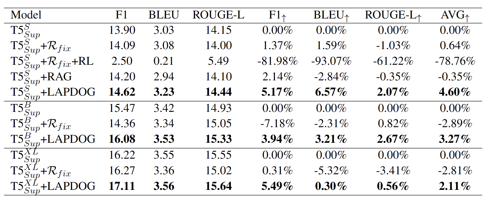

# LAPDOG
repo for Learning Retrieval Augmentation for Personalized Dialogue Generation. Our paper is available on [Learning Retrieval Augmentation for Personalized Dialogue Generation](https://aclanthology.org/2023.emnlp-main.154/).
## Introduction
Personalized dialogue generation, focusing on generating highly tailored responses by leveraging persona profiles and dialogue context, has gained significant attention in conversational AI applications. However, persona profiles, a prevalent setting in current personalized dialogue datasets, typically composed of merely four to five sentences, may not offer comprehensive descriptions of the persona about the agent, posing a challenge to generate truly personalized dialogues. To handle this problem, we propose **L**earning Retrieval **A**ugmentation for **P**ersonalized **D**ial**O**gue **G**eneration (**LAPDOG**), which studies the potential of leveraging external knowledge for persona dialogue generation. Specifically, the proposed LAPDOG model consists of a story retriever and a dialogue generator. The story retriever uses a given persona profile as queries to retrieve relevant information from the story document, which serves as a supplementary context to augment the persona profile. The dialogue generator utilizes both the dialogue history and the augmented persona profile to generate personalized responses. For optimization, we adopt a joint training framework that collaboratively learns the story retriever and dialogue generator, where the story retriever is optimized towards desired ultimate metrics (e.g., BLEU) to retrieve content for the dialogue generator to generate personalized responses. Experiments conducted on the CONVAI2 dataset with ROCStory as a supplementary data source show that the proposed LAPDOG method substantially outperforms the baselines, indicating the effectiveness of the proposed method. 
The LAPDOG model code is publicly available for further exploration. [https://github.com/hqsiswiliam/LAPDOG](https://github.com/hqsiswiliam/LAPDOG)
## Architecture

## Experimental Results


# Repo Details
## Basic Project Structure
- `ckpt`
  - The folder contains the generation results and checkpoint file
- `data/convai2`
    - This folder contains the CONVAI2 data preprocessed by us into jsonl file
- `data/corpora`
    - This folder contains the pre-processed stories from StoryROC dataset
- `src`
  - contains all the model and data processing code for training/evaluating LAPDOG
- 
## Checkpoint Download URL
- Since the original trained file has been missed in the server, we have re-trained a XL size model located in the [Huggingface Download Path](https://huggingface.co/hqsiswiliam/LAPDOG-XL/resolve/main/model.pth.tar).
- After the tar file has been downloaded, put this file as `ckpt/xl/ckpt/checkpoint/pth/model.pth.tar` 
## Environment Initialization
- The LAPDOG's environment can be built using Anaconda (which we recommend), we provide the `env.yml` for one-step environment creation
```bash
conda env create -f env.yml
```
## Basic Definitions
- reader: generator used in LAPDOG
- retriever: retriever used in LAPDOG
## Main Arguments
- `name`: experimental name
- `checkpoint_dir`: the path to save model
- `save_index_path`: the path to save retriever index
- `refresh_index`: the index refresh steps for retriever, -1 for never refresh (every `refresh_index` steps)
- `per_gpu_batch_size`: batch size per gpu for training/inferencing
- `total_steps`: the total step for the whole training process
- `eval_freq`: the steps for model evaluation (every `eval_freq` steps) 
- `save_freq`: the steps for model save (every `save_freq` steps) 
- `per_gpu_embedder_batch_size`: the batch size for retriever index embedding
- `gold_score_mode`: the metric to guide update the retriever
- `train_retriever`: whether to train the retriever
- `precision`: the precision of the model, fp16/bf16/fp32
- `shard_optim`: shards optimizer state over available GPUs 
- `shard_grads`: shards gradient over available GPUs
- `target_maxlength`: Maximum length of target outputs
- `generation_max_length`: similar to target max length
- `reader_model_type`: the model for the generator
- `dropout`: the dropout value for the architecture
- `weight_decay`: the weight decay for the optimizer
- `lr`: learning rate for generator
- `lr_retriever`: learning rate for retriever
- `scheduler`: which scheduler to be used to schedule learning rate
- `text_maxlength`: maximum number of tokens in input text segments (concatenated story+context)
- `retriever_from`: the query for the retriever
- `use_gradient_checkpoint_reader`: using gradient checkpoint for generator
- `use_gradient_checkpoint_retriever`: using gradient checkpoint for retriever
- `train_data`: the jsonl file to training data
- `eval_data`: the jsonl file to evaluation data
- `n_conetxt`: how many retrieved storied are fused to the generator
- `retriever_n_context`: the number of retrieved stories from story corpus
- `log_freq`: the log frequency in steps
- `wramup_steps`: the steps to do warm up
- `writing_results`: whether to write results after evaluation
- `task`: we are fixed to qa current, as the pre-processor in qa is to process CONVAI2 dataset
- `index_mode`: whether to use flat or faiss to retrieve top-k neighbours
- `passages`: the path to jsonl story corpus
- `save_index_n_shards`: how many shards to save an index to file with
- `temperature_score`: temperature parameter used in the loss computation
- `temperature_gold`: temperature parameter used in the loss computation
- `model_path`: path to initialize a model
- `load_reader_weights_only`: only read generator weight, no retriever weight are passed (after stage1, the checkpoint only contains the weight of generator)

## Example Training Script
### Stage 1 - Training a generator
- This example trains a generator on top of CUDA DEVICES 0 and 1, change the device indexes based on your own machine.
  - change NGPU and nproc_per_node to your available GPU numbers
```bash
export LR=5e-4 
export CUDA_VISIBLE_DEVICES=0,1
export NGPU=2
python -m torch.distributed.launch --master_port=29566 --nproc_per_node=2 train.py \
  --closed_book \
  --shuffle \
  --per_gpu_batch_size=64 \
  --total_steps=12000 \
  --eval_freq=1000 \
  --save_freq=1000 \
  --name= \
  --checkpoint_dir=ckpt/xp_exp \
  --use_gradient_checkpoint_reader \
  --precision=fp32 \
  --shard_optim \
  --shard_grads \
  --target_maxlength=32 \
  --generation_max_length=32 \
  --reader_model_type=google/t5-xl-lm-adapt \
  --dropout=0.1 \
  --weight_decay=0.01 \
  --lr=${LR} \
  --scheduler=linear \
  --text_maxlength=560 \
  --retriever_from=persona \
  --train_data="data/convai2/train.jsonl" \
  --eval_data="data/convai2/valid.jsonl" \
  --log_freq=1 \
  --warmup_steps=5 \
  --write_results
```
### Stage 2, tune a retriever
- After stage 1 model has been trained, train the LAPDOG based on the generator trained on the first stage
```bash
export STAGE1_GENERATOR=PATH_TO_THE_MODEL_TRAINED_IN_STAGE1
export LR=5e-4
export RET_LR=5e-4
export TEMP=0.8
export TEMPG=0.85
export NGPU=2
export CUDA_VISIBLE_DEVICES=0,1
python -m torch.distributed.launch --master_port=29899 --nproc_per_node=2 train.py \
--shuffle     \
--refresh_index=1200     \
--per_gpu_batch_size=8     \
--total_steps=12000     \
--eval_freq=1200     \
--save_freq=1200     \
--per_gpu_embedder_batch_size=128     \
--name=LAPDOG_XL     \
--checkpoint_dir=ckpt/xl_exp/    \
--save_index_path=ckpt/xl_exp/saved_index     \
--gold_score_mode=f1rougebleudist     \
--train_retriever     \
--precision=fp32     \
--shard_optim \
--shard_grads     \
--target_maxlength=32     \
--generation_max_length=32     \
--reader_model_type=google/t5-xl-lm-adapt     \
--dropout=0.1 \
--weight_decay=0.01 \
--lr=${LR} \
--lr_retriever=${RET_LR} \
--scheduler=linear     \
--text_maxlength=512     \
--retriever_from=persona     \
--use_gradient_checkpoint_reader     \
--use_gradient_checkpoint_retriever    \  
--train_data="data/convai2/train.jsonl" \
--eval_data="data/convai2/valid.jsonl" \
--n_context=6     \
--retriever_n_context=6     \
--log_freq=1     \
--warmup_steps=50     \
--write_results     \
--task=qa     \
--index_mode=flat     \
--passages="data/corpora/story/story.jsonl" \
--save_index_n_shards=128 \
--temperature_score=${TEMP}  \
--temperature_gold=${TEMPG} \
--model_path=${STAGE1_GENERATOR} \
--load_reader_weights_only
```
## Evaluation
We provide a script (`evaluation_test.sh`) to run evaluation on trained checkpoint. The content of the script is:
Also, you can check the jsonl located in the ckpt folder (`ckpt/xl/ckpt/valid-result.jsonl`) for referring.
```shell
NGPU=1 CUDA_VISIBLE_DEVICES=0 python -m torch.distributed.launch --master_port=28888 --nproc_per_node=1 evaluate.py \
    --reader_model_type=google/t5-xl-lm-adapt \
    --text_maxlength=512 \
    --checkpoint_dir=ckpt/xl/eval \
    --model_path=ckpt/xl/ckpt/checkpoint/pth/ \
    --per_gpu_batch_size=1 \
    --eval_data="data/convai2/valid.jsonl" \
    --n_context=6 \
    --retriever_n_context=6 \
    --index_mode="flat" \
    --precision=fp32     \
    --save_index_path=ckpt/xl/eval \
    --write_results \
    --passages="data/corpora/story/story.jsonl" \
    --retriever_from=persona \
    --passages="data/corpora/story/story.jsonl" \
    --generation_num_beams=1 \
    --generation_length_penalty=1
```

## Computing Metrics for the Generation Results
To compute the metric for the evaluation result, simply run
```shell
python compute_metrics.py
```
If you want to change the jsonl to be evaluate, change the path in line 64 in this py file to your desired one:
```python
...
file_name = 'ckpt/xl/ckpt/valid-result.jsonl'
...
```
# Citing
To cite this work, please use the following bibtex:
```
@inproceedings{huang-etal-2023-learning,
    title = "Learning Retrieval Augmentation for Personalized Dialogue Generation",
    author = "Huang, Qiushi  and
      Fu, Shuai  and
      Liu, Xubo  and
      Wang, Wenwu  and
      Ko, Tom  and
      Zhang, Yu  and
      Tang, Lilian",
    editor = "Bouamor, Houda  and
      Pino, Juan  and
      Bali, Kalika",
    booktitle = "Proceedings of the 2023 Conference on Empirical Methods in Natural Language Processing",
    month = dec,
    year = "2023",
    address = "Singapore",
    publisher = "Association for Computational Linguistics",
    url = "https://aclanthology.org/2023.emnlp-main.154",
    doi = "10.18653/v1/2023.emnlp-main.154",
    pages = "2523--2540",
    abstract = "Personalized dialogue generation, focusing on generating highly tailored responses by leveraging persona profiles and dialogue context, has gained significant attention in conversational AI applications. However, persona profiles, a prevalent setting in current personalized dialogue datasets, typically composed of merely four to five sentences, may not offer comprehensive descriptions of the persona about the agent, posing a challenge to generate truly personalized dialogues. To handle this problem, we propose $\textbf{L}$earning Retrieval $\textbf{A}$ugmentation for $\textbf{P}$ersonalized $\textbf{D}$ial$\textbf{O}$gue $\textbf{G}$eneration ($\textbf{LAPDOG}$), which studies the potential of leveraging external knowledge for persona dialogue generation. Specifically, the proposed LAPDOG model consists of a story retriever and a dialogue generator. The story retriever uses a given persona profile as queries to retrieve relevant information from the story document, which serves as a supplementary context to augment the persona profile. The dialogue generator utilizes both the dialogue history and the augmented persona profile to generate personalized responses. For optimization, we adopt a joint training framework that collaboratively learns the story retriever and dialogue generator, where the story retriever is optimized towards desired ultimate metrics (e.g., BLEU) to retrieve content for the dialogue generator to generate personalized responses. Experiments conducted on the CONVAI2 dataset with ROCStory as a supplementary data source show that the proposed LAPDOG method substantially outperforms the baselines, indicating the effectiveness of the proposed method. The LAPDOG model code is publicly available for further exploration.",
}
```